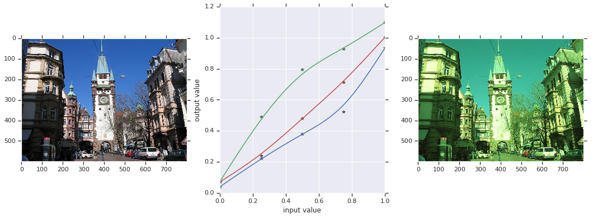

# How to use our Color Augmentation

## Motivation
Color augmentation helps to teach the network desired robustness and helps to reduce overfitting. Standard color augmentations (contrast, brightness) are often implemented as linear transforms, and so will most likely be directly compensated by the input normalization of a network. So we want to have non-linear augmentations (like gamma-correction and the S-curves in Photoshop). Trying to combine these two and find a reasonable parameterization ended in a nightmare, so here is a more straight-forward altern
ative.

## Approach
Instead of finding a parameterization, we just define the contraints to the mapping function -- which is much easier and intuitive (for the examples we assume float gray values between 0 and 1)

* the new "black point" should be within a certain range (e.g., -0.1 to 0.1)
* the new "white point" should be within a certain range (e.g., 0.9 to 1.1)
* the function should be reasonable smooth
* the slope of the function should be bounded (e.g., between 0.5 and 2.0)

The algorithm first samples control points (here 5) and then computes the smooth function via cubic bspline interpolation

1. sample a random value from the "black range" for the control point at 0, the new "black point"
2. sample a random value from the "white range" for the control point at 1, the new "white point"
3. recursively insert a new control point between the existing ones. Sample its value such that the slope contraints to both neightbours are fulfilled


## Imports

```python
from __future__ import absolute_import
from __future__ import division
from __future__ import print_function

import tensorflow as tf
import numpy as np

import PIL.Image
import matplotlib.pyplot as plt
from multidim_image_augmentation import augmentation_ops
from multidim_image_augmentation import deformation_utils
```

## Load a Nice Image

```python
url = 'https://upload.wikimedia.org/wikipedia/commons/6/61/Freiburg_Martinstor.jpg'
import requests
import StringIO

im = PIL.Image.open(StringIO.StringIO(requests.get(url).content))
im = np.array(im)
plt.imshow(im)
plt.grid(None)
```

## Create the Lookup Table
For each color channel (red, green, blue), sample the random control points, and compute the dense mapping function (lookup-table)

```python
tf.reset_default_graph()  # Important! Always start from an empty graph if you rerun this colab
lut_control_points = []
dense_lut = []
# create individual lut for each color (red, green, blue).
for _ in range(3):
  # sample random control points.
  cp = augmentation_ops.random_lut_control_points(
          new_black_range=[-0.1, 0.1],
          new_white_range=[0.9, 1.1],
          slope_min=0.5,
          slope_max=2.0,
          num_control_point_insertions=2)

  # keep a reference to each tensor (just needed for plotting).
  lut_control_points.append(cp)

  # create a dense lookup table by cubic bspline interpolation.
  dense_lut.append(
      tf.squeeze(augmentation_ops.cubic_interpolation1d(
          input=tf.expand_dims(cp, 1),
          factor=100)))

# combine lookup tables for red, green, and blue.
dense_lut_rgb = tf.stack([dense_lut[0],
                          dense_lut[1],
                          dense_lut[2]])
```

## Apply the Lookup Table to the Image
The lookup table in this example has 401 values, so we have to scale the input color values (range 0 ... 255) by a factor of 400/255. As we also want output colors in the range 0 ... 255, we multiply the lookup table by 255.

```python
im2 = augmentation_ops.apply_tabulated_functions(
    input=im,
    tabulated_functions = 255.0 * dense_lut_rgb,
    offset=0.0,
    scale=(dense_lut_rgb.shape[1].value - 1) / 255.0)
```

## Run the Graph and Plot the Results

```python
with tf.Session() as sess:
  lut_control_points_r_out, lut_control_points_g_out, lut_control_points_b_out, dense_lut_out, im2_out = sess.run([lut_control_points[0],lut_control_points[1],lut_control_points[2], dense_lut_rgb, im2])

fig, axes = plt.subplots(nrows=1, ncols=3, figsize=(18, 6))

axes[0].imshow(im)
axes[0].grid(None)

x = np.arange(0., 5.) / 4
axes[1].plot( x, lut_control_points_r_out, "r*")
axes[1].plot( x, lut_control_points_g_out, "g*")
axes[1].plot( x, lut_control_points_b_out, "b*")
axes[1].set_xlabel("input value")
axes[1].set_ylabel("output value")

x2 = np.arange(0., 401.) / 400.
axes[1].plot( x2, dense_lut_out[0,:], "r-")
axes[1].plot( x2, dense_lut_out[1,:], "g-")
axes[1].plot( x2, dense_lut_out[2,:], "b-")

im2_out[im2_out < 0] = 0
im2_out[im2_out > 255] = 255
axes[2].imshow(im2_out.astype(np.uint8))
axes[2].grid(None)
```

 [^footnote]

```
Outputs:
Skipped 1 binary outputs, 463263 bytes with hash 3c9d8be2dcab2402b0dc2abb07f62b5b
```

[^footnote]: All images are derived from
    [Wikimedia](https://commons.wikimedia.org/wiki/File:Freiburg_Martinstor.jpg)
    author [Luidger](https://commons.wikimedia.org/wiki/User:Luidger), and are
    licensed under the under the [Creative Commons Attribution-Share Alike 3.0
    Unported license](https://creativecommons.org/licenses/by-sa/3.0/deed.en)
