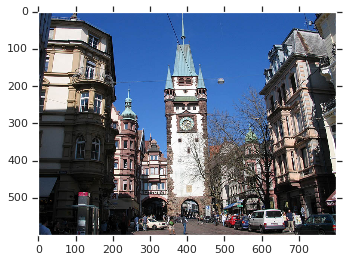
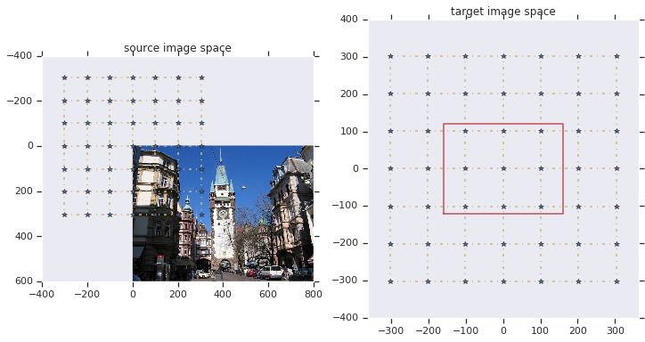
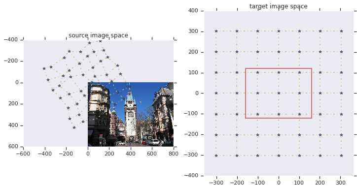
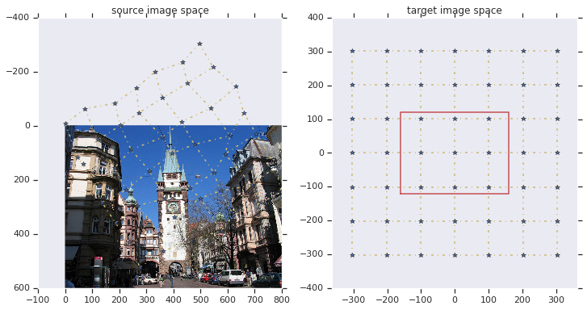
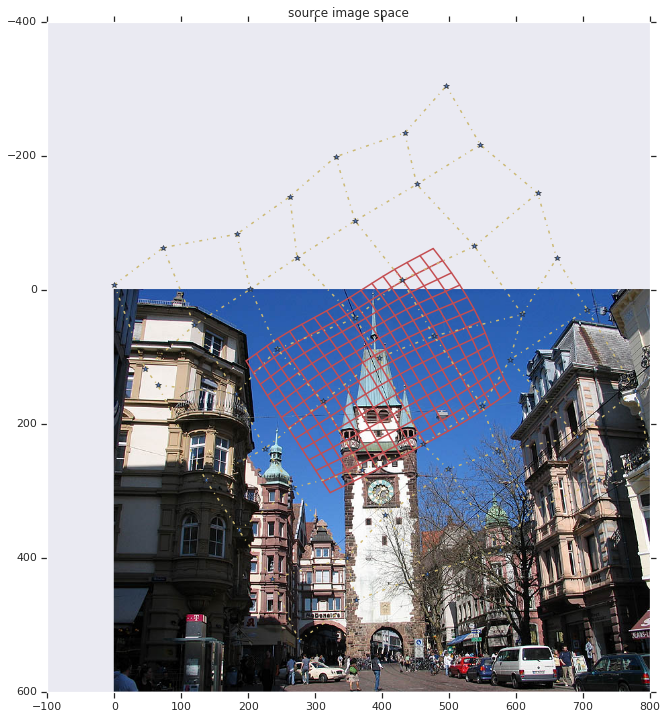
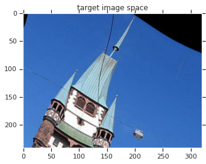

# How to use the On-the-Fly Elastic Deformation for TensorFlow

## Motivation
Data augmentation with elastic deformations during training helps a lot for generalization of the models and helps to prevent overfitting to the training data set. This Colab shows how to use our on-the-fly elastic deformation for Tensorflow. The key features are:
 * all types of spatial transformations (translation, rotation, scale, shear, and elastic) with a single convenient interface
 * very fast: all transformations get combined before they are applied to the image
 * same transformation can be efficiently applied to multiple images (e.g. raw image, segmentation mask, ignore mask)
 * different interpolations (nearest, linear) and extrapolations (zero-padding, const-padding, mirroring)
 * on-the fly conversion of segmentation maps to one-hot-encoding with linear interpolation in each resulting channel
 * implementations for planar (2D) and volumetric (3D) images, single channel (e.g. gray images) or multi-channel (e.g. RGB images)

## Implementation Overview
The transformation describes a mapping from the target image space to the source image space. This "inverse" description allows to iterate over all pixels in the target image and fill them with the interpolated gray- or color-value from the source image. The Implementation consists of 4 main steps

1. Setup a grid of control points
1. Apply all spatial transformations to the control points (very fast compared to operations on the full image)
1. Compute a dense transformation field using cubic bspline interpolation
1. Apply the dense transformation field to a number of images

These steps are shown below in detail

## Imports

```python
from __future__ import absolute_import
from __future__ import division
from __future__ import print_function

import tensorflow as tf
import numpy as np

import PIL.Image
import matplotlib.pyplot as plt
from multidim_image_augmentation import augmentation_ops
from multidim_image_augmentation import deformation_utils
```

## Function for pretty plotting of the control grid

```python
def plot_control_grids(source_grid, target_grid, transformed_image_shape, source_image=None):
  fig, axes = plt.subplots(nrows=1, ncols=2, figsize=(12, 6))

  if source_image is not None:
    axes[0].imshow(source_image)
  else:
    axes[0].axis('equal')
  axes[0].plot(source_grid[:,:,1], source_grid[:,:,0],"y-.")
  axes[0].plot(source_grid[:,:,1].T, source_grid[:,:,0].T,"y-.")
  axes[0].plot(source_grid[:,:,1], source_grid[:,:,0],"b*")
  axes[0].grid(None)
  axes[0].set_title('source image space', fontsize=12)

  axes[1].plot(target_grid[:,:,1], target_grid[:,:,0],"y-.")
  axes[1].plot(target_grid[:,:,1].T, target_grid[:,:,0].T,"y-.")
  axes[1].plot(target_grid[:,:,1], target_grid[:,:,0],"b*")
  xr = transformed_image_shape[1]/2
  yr = transformed_image_shape[0]/2
  axes[1].plot([-xr,xr,xr,-xr,-xr], [-yr,-yr,yr,yr,-yr],"r-")
  axes[1].axis('equal')
  axes[1].grid(None)
  axes[1].set_title('target image space', fontsize=12)
```

## Load the example image

```python
url = 'https://upload.wikimedia.org/wikipedia/commons/6/61/Freiburg_Martinstor.jpg'
import requests
import StringIO

im = PIL.Image.open(StringIO.StringIO(requests.get(url).content))
im = np.array(im)
plt.imshow(im)
plt.grid(None)
```

 [^footnote]

## Setup the control point grid
The grid has two extra control points outside the target image to allow a cubic bspline interpolation later without extra border handling. The grid is centered around the origin, such that the following affine tranformations can be easily performed by a matrix multiplication. The control point grid is represented by a 3D Tensor with a shape of N x M x 2 for the 2D case and a 4D Tensor with a shape of L x M x N x 3 for the 3D case. For biomedical images you usually know the real-world size of the pixels, and
 they might be non-square -- especially for 3D images. This framework does all operations (especially rotations) in real-world coordinates to correctly deal with this. For this example we just set the real-world pixel size "image_spacings" to [1,1]

```python
tf.reset_default_graph()  # Important! Always start from an empty graph if you rerun this colab
transformed_image_shape=[241,321]
control_grid_spacings_pix=[101,101]
control_grid = deformation_utils.create_control_grid_for_cubic_interp(
  transformed_image_shape=transformed_image_shape,
  transformed_image_spacings_um=[1,1],
  control_grid_spacings_pix=control_grid_spacings_pix)

with tf.Session() as sess:
  control_grid_out = sess.run(control_grid)
target_grid_vis = control_grid_out

plot_control_grids(control_grid_out, target_grid_vis, transformed_image_shape, im)
```



## Apply a random deformation
Add random offsets to the control points to apply a random deformation

```python
deformations_magnitudes_um = 15

# for this tutorial we want always the same "random" deformation
np.random.seed(123)
random_offsets = tf.constant(
    np.random.normal(0, deformations_magnitudes_um,
                     control_grid.get_shape().as_list()),dtype=np.float32)

# in a real application you want a different random deformation for every image
# random_offsets = deformations_magnitudes_um * tf.random_normal(
#    shape=control_grid.get_shape().as_list())

control_grid += random_offsets

# for debugging with a non-random deformation use the following code instead
#offset = np.zeros(control_grid.get_shape().as_list(),dtype=np.float32)
#offset[3,3,1] = 50
#offset[3,3,0] = -70
#control_grid += offset

with tf.Session() as sess:
  control_grid_out = sess.run(control_grid)

plot_control_grids(control_grid_out, target_grid_vis, transformed_image_shape,im)
```


## Apply affine transformation (rotation, scaling, shearing)
Initialize the affine transformation matrix with the rotation matrix

```python
rotation_angle = tf.constant(-np.pi*1./6.)  # defo.vectorized_random_uniform(-np.pi / 9, np.pi / 9)
affine = deformation_utils.create_2x2_rotation_matrix(rotation_angle)
```

Create a matrix for scaling and mirroring and combine it with the existing affine matrix. We also incorporate the scaling from real-world coordinates to pixels in the source image here.

```python
# setup (random) scale factors for the image.
scale_factors = tf.constant([1.,1.])  # deformation_utils.vectorized_random_uniform([.8, .8], [1.2, 1.2])

# setup (random) mirroring factors, i.e. scale by -1 or 1.
uniform_random = tf.random_uniform([], 0, 1.0, seed=None)
mirror_x0 = tf.to_float(tf.less(uniform_random, 0.5))
mirror_x1 = tf.to_float(tf.less(uniform_random, 0.5))
mirror_factors = tf.constant([1.,1.])  # tf.pack([2 * mirror_x0 - 1, 2 * mirror_x1 - 1])

# compute scaling factor from real-world to pixels.
raw_image_element_size_um = np.array([1,1])
scale_to_pix = 1. / raw_image_element_size_um

# create the scale matrix and combine it with the existing affine matrix.
scale_matrix = tf.diag(scale_factors * mirror_factors * scale_to_pix)
affine2 = tf.matmul(affine, scale_matrix)
```

Create the matrix for shearing and combine it with the existing affine matrix.

```python
shearing_coefs = tf.constant([0.,0.])  # deformation_utils.vectorized_random_uniform( [-.1, -.1], [.1, .1])
affine3 = tf.matmul(
  deformation_utils.create_2x2_shearing_matrix(shearing_coefs), affine2)
```

Transform all control points using this matrix. This is performed by reshaping the control point tensor to a single N x 2 matrix and multiplying the affine transformation matrix from the right -- yes I know this is a little bit ugly, for the "clean" way we would have had to shuffle around the data in the memory.

```python
control_grid = tf.reshape(
  tf.matmul(tf.reshape(control_grid, [-1, 2]), affine3),
  control_grid.get_shape().as_list())
```
Plot the resulting control points

```python
with tf.Session() as sess:
  control_grid_out, scale_out, affine_out, affine2_out = sess.run([control_grid, scale_matrix, affine, affine2])

print("affine matrix: ", affine_out)
print("scale matrix: ", scale_out)
print("affine2 matrix: ", affine2_out)

plot_control_grids(control_grid_out, target_grid_vis, transformed_image_shape, im)
```

```
Outputs:
affine matrix:  [[ 0.86602539  0.5       ]
 [-0.5         0.86602539]]
scale matrix:  [[ 1.  0.]
 [ 0.  1.]]
affine2 matrix:  [[ 0.86602539  0.5       ]
 [-0.5         0.86602539]]
```



## Translate the control points to the cropping position

```python
cropping_offset_pix = tf.constant([120.,400.])  # deformation_utils.vectorized_random_uniform([0., 0.], [600., 800.])
control_grid += cropping_offset_pix

with tf.Session() as sess:
  control_grid_out = sess.run(control_grid)

plot_control_grids(control_grid_out, target_grid_vis, transformed_image_shape, im)
```



## Create the Dense Deformation Field
Create the dense deformation field using cubic bspline interpolation. The resulting tensor has a "control point" for every pixel in the output image. I.e. for every output pixel, it defines where to sample the value in the source image.

```python
dense_deformation_field = augmentation_ops.cubic_interpolation2d(
      control_grid, control_grid_spacings_pix, transformed_image_shape)
```

Visualize the dense deformation field by plotting every 20th line into the source image

```python
with tf.Session() as sess:
  dense_deformation_field_out = sess.run(dense_deformation_field)

fig, axes = plt.subplots(nrows=1, ncols=1, figsize=(12, 12))

axes.imshow(im)
axes.plot(dense_deformation_field_out[::20,::20,1], dense_deformation_field_out[::20,::20,0],"r-")
axes.plot(dense_deformation_field_out[::20,::20,1].T, dense_deformation_field_out[::20,::20,0].T,"r-")
axes.plot(control_grid_out[:,:,1], control_grid_out[:,:,0],"y-.")
axes.plot(control_grid_out[:,:,1].T, control_grid_out[:,:,0].T,"y-.")
axes.plot(control_grid_out[:,:,1], control_grid_out[:,:,0],"b*")
axes.grid(None)
axes.set_title('source image space', fontsize=12)
```



## Apply the Dense Deformation Field to the Source Image
This operation iterates over the pixels of the target image and gets the color from the corresponding position in the source image. The positions are given in the dense deformation field. The color-value at an arbitrary (non-integer) position is determined using the selected interpolation strategy (here linear interpolation). If the position is outside of the source image, the selected extrapolation strategy is used (here zero padding).

```python
transformed_image = augmentation_ops.apply_deformation2d(
      im.astype(np.float32), dense_deformation_field, [],
      interpolation="linear", extrapolation="zero_padding")

show the resulting image

with tf.Session() as sess:
  transformed_image_out = sess.run(transformed_image)

plt.imshow(transformed_image_out.astype(np.uint8))
plt.grid(None)
plt.axes().set_title('target image space', fontsize=12)
```



[^footnote]: All images are derived from
    [Wikimedia](https://commons.wikimedia.org/wiki/File:Freiburg_Martinstor.jpg)
    author [Luidger](https://commons.wikimedia.org/wiki/User:Luidger), and are
    licensed under the under the [Creative Commons Attribution-Share Alike 3.0
    Unported license](https://creativecommons.org/licenses/by-sa/3.0/deed.en)
